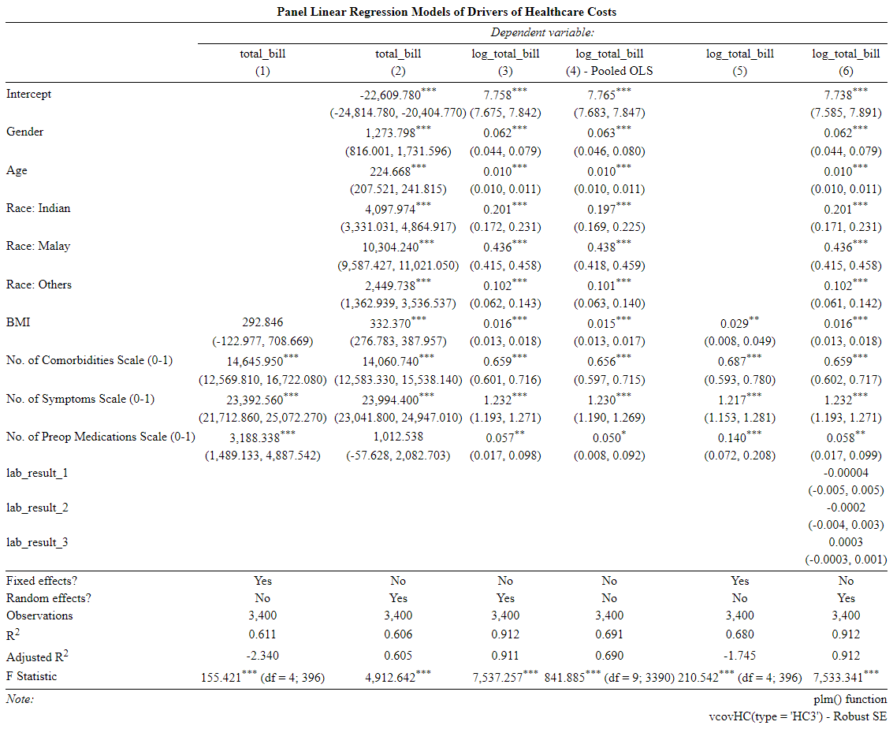

> Using the unbalanced panel dataset, the multiple linear regression with random effects model is used to determine the major contributing factors of the healthcare costs for patients hospitalized for a certain condition.

```{r setup, include = F}
knitr::opts_chunk$set(echo = F)
```

# Research Methodology

##
1. Importing and Merging Data Sets
2. Data Cleaning
3. Regression Model
4. Residual Diagnostics
5. Regression Diagnostics

```{r}
pacman::p_load(dplyr, tidyverse, lubridate,
               broom, scales,
               Hmisc, car, psych,
               jtools, huxtable,
               DT,
               knitr, kableExtra,
               effects, table1, plm,
               lmtest, sandwich)
```

# Importing & Merging Datasets

##

- The 4 data sets are merged initially by matching [`patient_id`]() and [`bill_id`]().
```{r, include = FALSE}
setwd("~/Holmusk/Healthcare Data Challenge Data/Healthcare Data Challenge Data")

# Read CSV files containing bill data
bill_amount <- read_csv("bill_amount.csv")
glimpse(bill_amount)
bill_id <- read_csv("bill_id.csv")
glimpse(bill_id)

# Merge CSV files by bill_id
bill_data <- merge(bill_amount, bill_id, by = "bill_id")

# Check for presence of NA in merged bill data
sum(is.na(bill_data))

# Read CSV files containing clinical data and demographics
clinical_data <- read_csv("clinical_data.csv")
glimpse(clinical_data)

# Rename column name to match patient_id in demographic dataset
clinical_data <- clinical_data %>% 
  rename(patient_id = id) 

demographics <- read_csv("demographics.csv")
glimpse(bill_id)

# Merge bill data with demographic data set and check matching has been done correctly
bill_demo_data <- merge(bill_data, demographics, by = "patient_id")
glimpse(bill_demo_data)

# Merge bill data with clinical data set
final_data <- merge(bill_demo_data, clinical_data, by = c("patient_id", "date_of_admission"))
```

- In the merged data set, each unique [`patient_id`]() may matched to several [`biil_ids`]() with the same admission date, the observations are collapsed further to consolidate the total bill incurred for each hospitalization event, with 3,000 unique patient ids and 3,400 unique id-time observations.


# Data Cleaning

##
- Inconsistency in data input of variables such as [`gender`](), [`resident_status`]() and [`medical_history_3`]() are cleaned.

- Additional continuous variables are created for regression model:
  1. [***`bmi`***]()  - standardized scale for comparison which takes into account both height and weight
  2. [***`medication`***]() - standardized scale (0 - 1) on number of preop_medications taken
  3. [***`sym_count`***]() - standardized scale (0 - 1) on number of symptoms experienced
  4. [***`comorbid`***]() - standardized scale (0 - 1) on number of medical histories applicable
```{r, include = FALSE}
unique(final_data[c('medical_history_3', 'gender', 'resident_status')])

data_cleaned <- final_data %>%
  mutate(gender = ifelse((gender == "m" | gender == "Male"), 1, 0),
         race = ifelse(race == "chinese", "Chinese", race),
         race = ifelse(race == "India", "Indian", race),
         resident_status = ifelse(resident_status == "Singapore citizen", "Singaporean", resident_status),
         medical_history_3 = ifelse((medical_history_3 == "Yes" | medical_history_3 == "1"), 1, 0),
         amount_log = log(amount),
         age = 2021 - year(date_of_birth),
         hosp_duration = as.duration(date_of_discharge - date_of_admission) / ddays(1),
         bmi = weight/(height/100)^2,
         medication = rowMeans(final_data %>% 
                                 dplyr::select(preop_medication_1, preop_medication_2, preop_medication_3, 
                                               preop_medication_4, preop_medication_5), na.rm = TRUE),
         sym_count = rowMeans(final_data %>% 
                                dplyr::select(symptom_1, symptom_2, symptom_3, symptom_4, symptom_5), na.rm = TRUE),
         day_of_admission = day(date_of_admission),
         month_of_admission = month(date_of_admission),
         year_of_admission = year(date_of_admission))

data_cleaned <- data_cleaned %>% 
  mutate(comorbid = rowMeans(data_cleaned %>% 
                               dplyr::select(medical_history_1, medical_history_2, medical_history_3, 
                                             medical_history_4, medical_history_5, medical_history_6, 
                                             medical_history_7), na.rm = TRUE),
         amount_per_day = amount/hosp_duration)

# Combined bill amount by both patient_id and hospitalization visit (using date of admission)
data_cleaned2 <- data_cleaned %>% 
  dplyr::group_by(patient_id, date_of_admission) %>% 
  mutate(total_bill = sum(amount),
         log_total_bill = log(total_bill)) %>% 
  distinct(patient_id, date_of_admission, .keep_all = TRUE) %>% 
  ungroup()
```


##

```{r, echo = FALSE, message=FALSE, warning=FALSE}
histogram_bill_amount <- data_cleaned2 %>%
  ggplot(aes(x = amount)) +
  geom_histogram(fill="blue", alpha=0.5, position="identity") +
  labs(title = "Distribution of Healthcare Costs is heavily right-skewed and non-negative.",
       subtitle = "Hence, logarithmic tranformation of the outcome variable is done in order to better fit the linear model assumptions and interpretation.",
       x = "Bill Amount",
       y = "Count") +
scale_y_continuous(labels = comma) +
scale_x_continuous(labels = dollar) +
theme_bw()
histogram_bill_amount
```

## Correlation Table between Variables

```{r, echo = FALSE, message=FALSE, warning=FALSE}
# View Correlation Table between variables
data_cleaned2 %>% 
  dplyr::select(amount, gender, age, medication, comorbid, sym_count, medical_history_1, medical_history_2, medical_history_3, 
         medical_history_4, medical_history_5, medical_history_6, medical_history_7, preop_medication_1,
         preop_medication_2, preop_medication_3, preop_medication_4, preop_medication_5,
         preop_medication_6, symptom_1, symptom_2, symptom_3, symptom_4, symptom_5, lab_result_1,
         lab_result_2, lab_result_3, weight, height, hosp_duration) %>% 
  as.matrix(.) %>% 
  Hmisc::rcorr() %>% 
  broom::tidy(.) %>% 
  DT::datatable(
     options=list(
       initComplete = htmlwidgets::JS(
          "function(settings, json) {",
          paste0("$(this.api().table().container()).css({'font-size': '18px'});"),
          "}")
       ),
     colnames = c("Variable 1", "Variable 2", "Correlation Coefficient", "N", "P Value"),
     ) %>% 
  DT::formatStyle(columns = c(1, 2, 3, 4, 5), font_size("20pt")) %>% 
  DT::formatRound(columns = c(3, 5), digits = 3)
```

# Regression Model

##
- The `plm` package is used to run multiple linear regression model on panel data with individual fixed effects and random effects.

- [Hausman Test]() is subsequently used to decide between fixed or random effects, where null hypothesis suggest that the preferred model is random effects.

## Individual Fixed Effects Model - Total Bill as Outcome Variable

```{r, include = FALSE, message=FALSE, warning=FALSE}
panel_data_cleaned2 <- pdata.frame(data_cleaned2, index=c("patient_id", "date_of_admission"))

model1_plm <- plm(total_bill ~ gender + age + as.factor(race) + bmi + comorbid + sym_count + medication, 
                  data = panel_data_cleaned2,
                  index = c("patient_id", "date_of_admission"),
                  model = "within")
summary(model1_plm)
```

```{r, echo = FALSE, message=FALSE, warning=FALSE}
summary_table_1 <- coeftest(model1_plm, vcov. = vcovHC(model1_plm, method = "white2", type = "HC3"))
confidence_intervals_1 <- confint(model1_plm)
coeff_table_1 <- cbind(summary_table_1, confidence_intervals_1)
knitr::kable(coeff_table_1, 
             #caption = "Model 1 - Regression Coefficients with 95% CIs",
             col.names = c("Raw Estimate", "Robust S.E.", " T Value", "P Value", "Raw Estimate - 2.5%", "Raw Estimate - 97.5%"),
             digits = 3) %>%
  kable_styling("striped", "condensed", "hover", position = "center", full_width = F, fixed_thead = F, font_size = 14)
```

## Random Effects Model - Total Bill as Outcome Variable

```{r, include = FALSE, message=FALSE, warning=FALSE}
model2_plm <- plm(total_bill ~ gender + age + as.factor(race) + bmi + comorbid + sym_count + medication, 
                  data = panel_data_cleaned2,
                  index = c("patient_id", "date_of_admission"),
                  model = "random")
summary(model2_plm)
```

```{r, echo = FALSE, message=FALSE, warning=FALSE}
summary_table_2 <- coeftest(model2_plm, vcov. = vcovHC(model2_plm, method = "white2", type = "HC3"))
confidence_intervals_2 <- confint(model2_plm)
coeff_table_2 <- cbind(summary_table_2, confidence_intervals_2)
knitr::kable(coeff_table_2, 
             #caption = "Model 2 - Regression Coefficients with 95% CIs",
             col.names = c("Raw Estimate", "Robust S.E.", " T Value", "P Value", " Raw Estimate - 2.5%", "Raw Estimate - 97.5%"),
             digits = 3) %>%
  kable_styling("striped", "condensed", "hover", position = "center", full_width = F, fixed_thead = F, font_size = 14)
```

## Random Effects Model - Log(Total Bill) as Outcome Variable

```{r, include = FALSE, message=FALSE, warning=FALSE}
model3_plm <- plm(log_total_bill ~ gender + age + as.factor(race) + bmi + comorbid + sym_count + medication, 
                  data = panel_data_cleaned2,
                  index = c("patient_id", "date_of_admission"),
                  model = "random")
summary(model3_plm)
```

```{r, echo = FALSE, message=FALSE, warning=FALSE}
summary_table_3 <- coeftest(model3_plm, vcov. = vcovHC(model3_plm, method = "white2", type = "HC3"))
confidence_intervals_3 <- exp(confint(model3_plm))
coeff_table_3 <- cbind(summary_table_3, confidence_intervals_3)
knitr::kable(coeff_table_3, 
             #caption = "Model 3 - Regression Coefficients with 95% CIs",
             col.names = c("Raw Estimate", "Robust S.E.", " T Value", "P Value", "Exp(Estimate) - 2.5%", "Exp(Estimate) - 97.5%"),
             digits = 3) %>%
  kable_styling("striped", "condensed", "hover", position = "center", full_width = F, fixed_thead = F, font_size = 14)
```
## Pooled OLS Model for Comparison - Log(Total Bill) as Outcome Variable

```{r, include=FALSE, message=FALSE, warning=FALSE}
model4_plm <- plm(log_total_bill ~ gender + age + as.factor(race) + bmi + comorbid + sym_count + medication, 
                  data = panel_data_cleaned2,
                  index = c("patient_id", "date_of_admission"),
                  model = "pooling")
summary(model4_plm)
```

```{r, echo = FALSE, message=FALSE, warning=FALSE}
summary_table_4 <- coeftest(model4_plm, vcov. = vcovHC(model4_plm, method = "white2", type = "HC3"))
confidence_intervals_4 <- exp(confint(model4_plm))
coeff_table_4 <- cbind(summary_table_4, confidence_intervals_4)
knitr::kable(coeff_table_4, 
             #caption = "Model 4 - Regression Coefficients with 95% CIs",
             col.names = c("Raw Estimate", "Robust S.E.", " T Value", "P Value", "Exp(Estimate) - 2.5%", "Exp(Estimate) - 97.5%"),
             digits = 3) %>%
  kable_styling("striped", "condensed", "hover", position = "center", full_width = F, fixed_thead = F, font_size = 14)
```

## Individual Fixed Effects Model for Comparison - Log(Total Bill) as Outcome Variable
```{r, include=FALSE, message=FALSE, warning=FALSE}
model5_plm <- plm(log_total_bill ~ gender + age + as.factor(race) + bmi + comorbid + sym_count + medication, 
                  data = panel_data_cleaned2,
                  index = c("patient_id", "date_of_admission"),
                  model = "within")
summary(model5_plm)
```

```{r, echo = FALSE, message=FALSE, warning=FALSE}
summary_table_5 <- coeftest(model5_plm, vcov. = vcovHC(model5_plm, method = "white2", type = "HC3"))
confidence_intervals_5 <- exp(confint(model5_plm))
coeff_table_5 <- cbind(summary_table_5, confidence_intervals_5)
knitr::kable(coeff_table_5, 
             #caption = "Model 5 - Regression Coefficients with 95% CIs",
             col.names = c("Raw Estimate", "Robust S.E.", " T Value", "P Value", "Exp(Estimate) - 2.5%", "Exp(Estimate) - 97.5%"),
             digits = 3) %>%
  kable_styling("striped", "condensed", "hover", position = "center", full_width = F, fixed_thead = F, font_size = 14)
```
## Random Effects Model with Lab Result Variables - Log(Total Bill) as Outcome Variable

```{r, include = FALSE, message=FALSE, warning=FALSE}
model6_plm <- plm(log_total_bill ~ gender + age + as.factor(race) + bmi + comorbid + sym_count + medication + lab_result_1 + lab_result_2 + lab_result_3,
                  data = panel_data_cleaned2,
                  index = c("patient_id", "date_of_admission"),
                  model = "random")
summary(model6_plm)
```

```{r, echo = FALSE, message=FALSE, warning=FALSE}
summary_table_6 <- coeftest(model6_plm, vcov. = vcovHC(model6_plm, method = "white2", type = "HC3"))
confidence_intervals_6 <- exp(confint(model6_plm))
coeff_table_6 <- cbind(summary_table_6, confidence_intervals_6)
knitr::kable(coeff_table_6, 
             #caption = "Model 6 - Regression Coefficients with 95% CIs",
             col.names = c("Raw Estimate", "Robust S.E.", " T Value", "P Value", "Exp(Estimate) - 2.5%", "Exp(Estimate) - 97.5%"),
             digits = 3) %>%
  kable_styling("striped", "condensed", "hover", position = "center", full_width = F, fixed_thead = F, font_size = 14)
```


## Correlation between No. of Comorbidities and Log(Total Bill)


```{r}
coplot(log_total_bill ~ comorbid | age * gender, data = panel_data_cleaned2, 
       overlap = 0,
       xlab = "Number of Comorbidities on Standardized Scale 0 - 1",
       ylab = "Log (Total Bill)",
       panel = function(x, y, ...) {
       points(x, y, ...)
       abline(lm(y ~ x), col = "blue")})
```

## Correlation between No. of Symptoms and Log(Total Bill)

```{r}
coplot(log_total_bill ~ sym_count | age * gender, data = panel_data_cleaned2,
       overlap = 0,
       xlab = "Number of Symptoms on Standardized Scale 0 - 1",
       ylab = "Log (Total Bill)",
       panel = function(x, y, ...) {
       points(x, y, ...)
       abline(lm(y ~ x), col = "blue")})
```

## Correlation between No. of Medications taken and Log(Total Bill)

```{r}
coplot(log_total_bill ~ medication | age * gender, data = panel_data_cleaned2,
       overlap = 0,
       xlab = "Number of Preop Medications Taken on Standardized Scale 0 - 1",
       ylab = "Log (Total Bill)",
       panel = function(x, y, ...) {
       points(x, y, ...)
       abline(lm(y ~ x), col = "blue")})
```

## Comparison of Regression Models

## 
```{r, include= FALSE, message=FALSE, warning=FALSE, out.width="50%", out.height="50%", results='asis'}
library(stargazer)

rob_se <- list(sqrt(diag(vcovHC(model1_plm, method = "white2", type = "HC3"))),
              sqrt(diag(vcovHC(model2_plm, method = "white2", type = "HC3"))),
              sqrt(diag(vcovHC(model3_plm, method = "white2", type = "HC3"))),
              sqrt(diag(vcovHC(model4_plm, method = "white2", type = "HC3"))),
              sqrt(diag(vcovHC(model5_plm, method = "white2", type = "HC3"))),
              sqrt(diag(vcovHC(model6_plm, method = "white2", type = "HC3"))))


stargazer(model1_plm, model2_plm, model3_plm, model4_plm, model5_plm, model6_plm, 
                     digits = 3,
                     header = FALSE,
                     align = TRUE,
                     ci = TRUE,
                     ci.level = 0.95,
                     type = "html", 
                     se = rob_se,
                     title = "Panel Linear Regression Models of Drivers of Healthcare Costs",
                     covariate.labels = c("Intercept", "Gender", "Age",
                                          "Race: Indian", "Race: Malay", "Race: Others",
                                          "BMI", "No. of Comorbidities Scale (0-1)", "No. of Symptoms Scale (0-1)",
                                          "No. of Preop Medications Scale (0-1)"),
                     model.numbers = FALSE,
                     multicolumn = FALSE,
                     column.labels = c("(1)", "(2)", "(3)", "(4) - Pooled OLS", "(5)", "(6)"),
                     font.size = "tiny",
                     single.row = FALSE,
                     no.space = TRUE,
                     column.sep.width = "1pt",
                     add.lines = list(c("Fixed effects?", "Yes", "No", "No", "No", "Yes", "No"),
                                      c("Random effects?", "No", "Yes", "Yes", "No", "No", "Yes")),
                     notes = c("plm() function", "vcovHC(type = 'HC3') - Robust SE"),
                     notes.append = FALSE,
                     intercept.bottom = FALSE,
                     star.cutoffs = c(0.05, 0.01, 0.001),
                     out = "models.html")

```
```{r echo=FALSE, out.height= "85%", out.width="85%", fig.align="center"}

```


# Residual Diagnostics

## Distribution of Residuals

<small> The residuals are approximately normally distributed which means the multiple linear regression model could be reasonably used to draw accurate inferences of the model estimates. </small>
```{r, echo = FALSE, message=FALSE, warning=FALSE}
hist(residuals(model3_plm), 
     xlab = 'Residuals',
     main = paste("Histogram of", "Random Effects Model (Model 3)"),
     freq = TRUE,
     xlim = range(-1, 1),
     ylim = range(0, 800))
```


## Q-Q Plot of Residuals
<small> Visual display of residuals is reasonably close to the straight line, except for the extreme values at the lower and upper tails where residuals are larger than expected. </small>
```{r, echo = FALSE, message=FALSE, warning=FALSE}
qqnorm(residuals(model3_plm), ylab = 'Residuals')
qqline(residuals(model3_plm))
```

## Residual Plot of PLM Regression with R.E.

<small> The unstructured cloud of points centered at zero which suggested independence between residuals and fitted values, which satisfies homoskedasticity assumption of linear regression. </small>
```{r, echo = FALSE, message=FALSE, warning=FALSE}
resp <- pmodel.response(model3_plm, data = panel_data_cleaned2, model = "random")
plot(as.numeric(resp), as.numeric(residuals(model3_plm)),
     xlab='Fitted Values',
     ylab='Residuals')
abline(a=0, b=0)
```

# Regression Diagnostics

## Fixed or Random Effects: Hausman Test

<small> Since the null hypothesis **cannot** be rejected, the random effects model is preferred. </small>

```{r, echo = FALSE, message=FALSE, warning=FALSE}
phtest(model3_plm, model5_plm)
```

## Lagrange Multiplier Test for Random Effects

<small>The null hypothesis in the LM test is that variances across individuals is zero.</small> 

<small>Since the null hypothesis **can** be rejected in favor of the alternative, this means that there is significant difference across units (i.e. panel effect exists). </small>

```{r, echo = FALSE, message=FALSE, warning=FALSE}
plmtest(model3_plm, type=c("bp"))
```

# Discussion Points

## 
- Need for specific domain knowledge to assess of there could be other confounders to deduce if causal inference coud be made
- Alternative model? PGLM with Gamma distribution with log link, that performs satisfactorily with distributions with long right tails